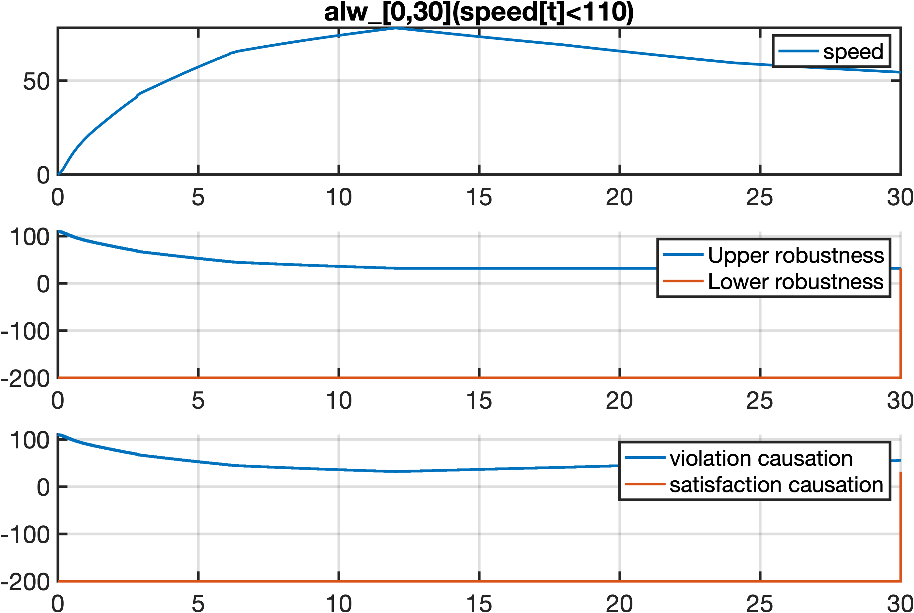
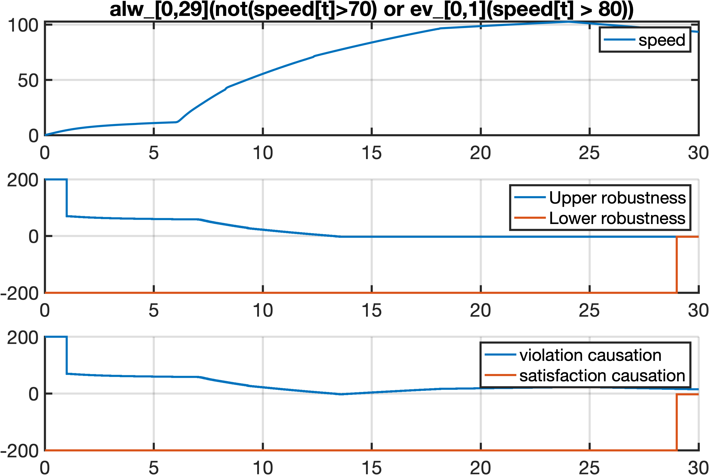
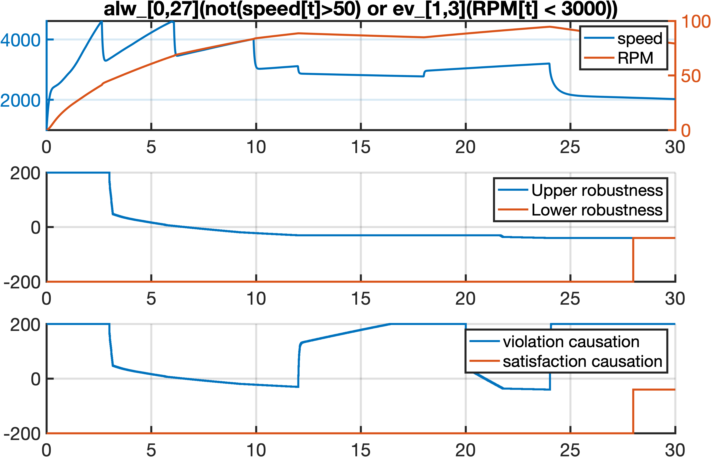
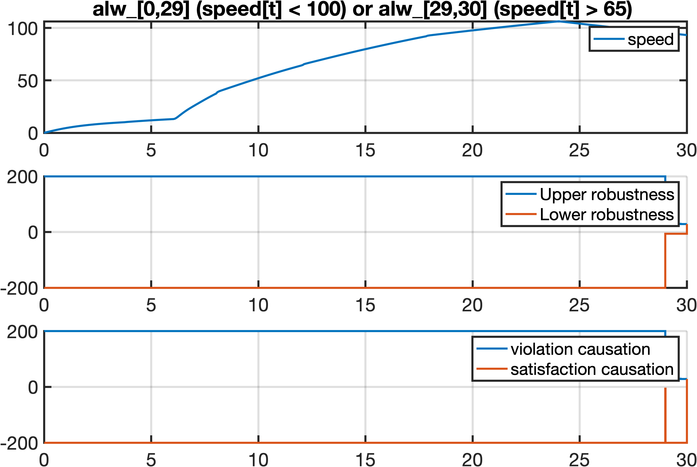
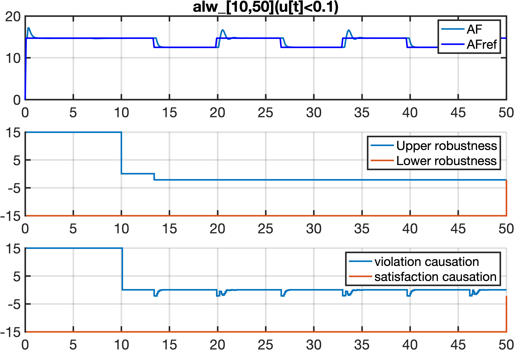
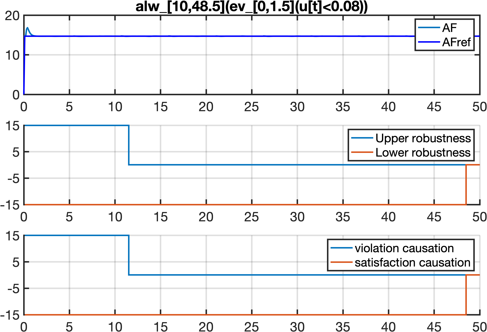

# CauMon: An Informative Online Monitor for Signal Temporal Logic

This repository is for the artifact evaluation of the paper "CauMon: An Informative Online Monitor for Signal Temporal Logic", accepted by FM 2024.

## Instructions for Artifact Evaluation

***
### Preparation
- Load the docker container by:

  `docker load < caumon.tar`

- Run the docker container by:

  `docker run -it -v $PWD/results:/root/EfficientCausationMonitor/results --shm-size=512M caumon`

  Input your MATLAB license information (MATLAB account that has a license) to activate MATLAB in docker container. 

***
### Reproduce Results in Paper

#### Reproduce Table 3

- Run `Table3` in MATLAB commandline.
- There will be a number of prompts by which one can choose the experiments to reproduce. For example, one can reproduce the experiments of phi_AT^1 with trace #1, i.e., the first row of the first sub-table of Table 3:
  ```
  Input the model number: 1. AT, 2. AFC, 3. NN, 4. FFR
  1
  Input the specification number: 1. AT1, 2. AT2, 3. AT3, 4. AT4
  1
  Input the trace ID you want to check: (1~10)
  1
  Input the number you want to repeat each experiments (Default: 1)
  5
  Do you want to skip experiments for plain causation monitor? Y/N
  N
  ```
  Since the execution time of some monitors for some specifications is extremely long, we offer the option to skip those results (by answering 'Y' in the last question).
- After waiting for some time, the results will be stored in `results/` in the container and also `$PWD/results/` in your local directory

#### Reproduce Figure 2a

- Run `Figure2a` in MATLAB commandline.
- Results will be stored in `results/` in the container and also in `$PWD/results/` in your local directory.

#### Reproduce Figure 2b

- Run `Figure2a` in MATLAB commandline.
- Results will be stored in `results/` in the container and also in `$PWD/results/` in your local directory.

***
### Usage for New Problem Instances

#### Usage for new systems

The function of our tool is realized by a C++ function `stl_causation_opt`. The interface of `stl_causation_opt` has been introduced in Section 5 of our paper, which requires 4 arguments:
  - `signal_str`: the names (string) of the signals, e.g., for AT it is `'speed,RPM'`
  - `phi_str`: the STL specification, following the STL syntax rule in [Breach](https://github.com/decyphir/breach)
  - `trace`: the partial trace to be monitored. It has several dimensions: the first dimension is time; the following dimensions respectively correspond to the signals in `signal_str`.
  - `tau`: the time point to monitor. See Def. 4 in the paper.

We showcase this usage by an example of *Chasing Car*, taken from [ARCH-COMP2023](https://easychair.org/publications/paper/wFh9) (See Section 2.2).
Some traces and some specifications have been stored in `experiment/data/CAR_phiX_traceX.mat`.

To run this example, 
- Run `New`.
- After waiting for some time, the results will be stored in `results/` in the container and also `$PWD/results/` in your local directory.
- One can also change Line 3-6 to try other traces and specifications.

#### Customize the code

The experiments above are based on system execution traces stored in log files. More specifically, we rely on the MEX functions of MATLAB and so we can execute `stl_causation_opt` as a MATLAB function to monitor the traces extracted from Simulink models.

Note that users can also customize the code for other use. Some useful tips are as follows:
- Compile the code as C++ executables other than MATLAB function by removing `#include "mex.h"` in the source code in `Online/include/` and `Online/src/`;
- The current main file is `Online/include/stl_causation_opt.cpp`. This function takes the whole trace as input and returns the final monitoring results. It has a loop that incrementally loads a partial trace and returns the verdict for that partial trace. To apply our tool to monitoring of other systems, one needs to go through a similar workflow of `Online/include/stl_causation_opt.cpp`, and notably, the following two lines are used to return the verdict for partial traces.
```
 78             rob_up = phi->causation_opt_upper();
 79             rob_low= phi->causation_opt_lower();
``` 

***
### Structure of the Repository

```
.
├── Core
│   └── m_src
│       └── varargin2struct_breach.m
├── Ext
├── Figure2a.m
├── Figure2b.m
├── InitBreach.m
├── InstallBreach.m
├── LICENSE
├── New.m
├── Online
│   ├── bin
│   │   ├── onlineMonitorWrapper.mexa64
│   │   ├── onlineMonitorWrapper.mexmaci64
│   │   ├── onlineMonitorWrapper.mexw64
│   │   ├── stl_causation.mexa64
│   │   ├── stl_causation.mexmaci64
│   │   ├── stl_causation_mid.mexmaci64
│   │   ├── stl_causation_opt.mexa64
│   │   ├── stl_causation_opt.mexmaci64
│   │   ├── stl_eval_mex.mexa64
│   │   ├── stl_eval_mex.mexmaci64
│   │   ├── stl_eval_mex.mexw64
│   │   ├── stl_eval_mex_pw.mexa64
│   │   └── stl_eval_mex_pw.mexmaci64
│   ├── include
│   │   ├── FlexLexer.h
│   │   ├── interval.h
│   │   ├── location.hh
│   │   ├── position.hh
│   │   ├── robustness.h
│   │   ├── signal.h
│   │   ├── signal_expr.h
│   │   ├── stack.hh
│   │   ├── stdafx.h
│   │   ├── stl_driver.h
│   │   ├── stl_parser.h
│   │   ├── stl_scanner.h
│   │   ├── tools.h
│   │   ├── transducer.asv
│   │   ├── transducer.h
│   │   └── y.tab.h
│   ├── m_src
│   │   └── compile_stl_mex.m
│   ├── obj
│   └── src
│       ├── Makefile_Parser
│       ├── interval.cpp
│       ├── interval_transducer.cpp
│       ├── main.cpp
│       ├── onlineMonitorWrapper.cpp
│       ├── robustness.cpp
│       ├── signal.cpp
│       ├── signal_expr.cpp
│       ├── stl_atom.cpp
│       ├── stl_causation.cpp
│       ├── stl_causation_mid.cpp
│       ├── stl_causation_opt.cpp
│       ├── stl_driver.cpp
│       ├── stl_eval_mex.cpp
│       ├── stl_eval_mex_pw.cpp
│       ├── stl_monitor.cpp
│       ├── stl_parser.cpp
│       ├── stl_parser.ypp
│       ├── stl_scanner.cpp
│       ├── stl_scanner.lpp
│       ├── tools.cpp
│       ├── transducer.cpp
│       └── update_transducer.cpp
├── experiment
│   ├── data
│   ├── exec.m
│   └── plots
└── results
```


<!-- 
***

## System requirement

If you want to compile from source code, the requirement is as follows:

- C++ compiler.

- MATLAB (Simulink/Stateflow) version: >= 2020a. (MATLAB license needed)

Alternatively, you can also use the executables available in `Online/bin/`.

## Installation:

- Clone this repository
  
- Start MATLAB GUI, set up a C/C++ compiler using the command `mex -setup`. (Refer to [here](https://www.mathworks.com/help/matlab/matlab_external/changing-default-compiler.html) for more details.)
  > Running with MATLAB in shell is also OK.

- Navigate to the project home, and run `InstallBreach`
  > Note that we customized `InstallBreach`. It only compiles the online monitoring component. For the full functionality of Breach, please refer to [the original repository](https://github.com/decyphir/breach)

## Code Instruction:

- source code is in `Online/src` and `Online/include`
- executables are in `Online/bin`
- main function of robust online monitor [FMSD'17] is `Online/src/stl_eval_mex_pw.cpp`
- main function of causation monitor is `Online/src/stl_causation_opt.cpp`
- see `experiment/exec.m` for the usage of the two main functions
  - the STL syntax follows [Breach](https://github.com/decyphir/breach)
  - currently, syntactically, causation monitor doesn't support "until", "=>".  

***

## Reproduction of experiments in paper

- Navigate to `experiment/`, all the traces and specifications have been stored at those `.mat` files
  
- In Line 3 of `exec.m`, specify the problem instance you want to run

- run `exec.m` in MATLAB.

***

## Supplementary results
In each of the figures below, there are three sub-plots:
  - the top sub-plot is the signal being monitored;
  - the middle sub-plot is the monitoring result of robust online monitors;
  - the bottom sub-plot is the monitoring result of our proposed efficient causation monitors;

<p float="left">
   
  
</p>
<p float="left">
  
  
</p>
<p float="left">
  
  
</p>

## How to draw such plots

- Navigate to `experiment/`, and open `plot_fig.m`
  
- Specify the problem instance you want to run, also specify the ID of the signal stored in `experiment/data/`
  
- Run `plot_fig.m`
-->
